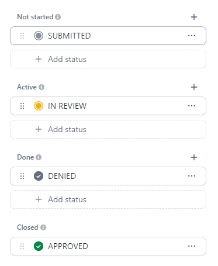
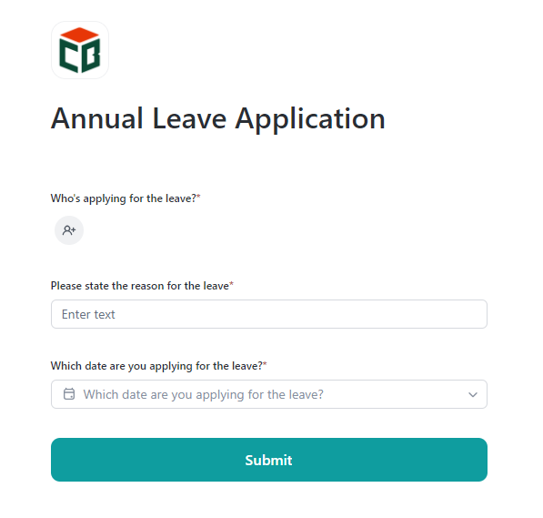
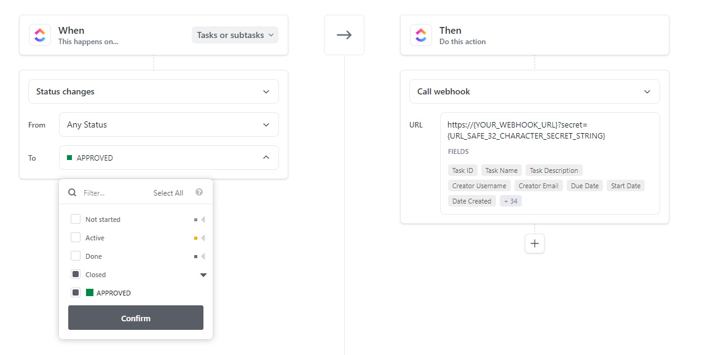

# Leave Marker

## Problem scenario(s)

1. There should be a way for our team who uses Clickup as a management tool to raise/mark leaves but currently
(as of 29th August 2024) there's no direct way of doing that in ClickUp. 
2. Leaves shall also be reflected in the global time sheet view as full day work for the user.
3. When leaves are approved, they shall be synced with AllHours - Our attendance management system.


## Our approach to the problem

Leverage ClickUp automations along with forms and webhooks. Let me explain:
1. Whenever a team member wants to raise a leave, they shall do so via a form.
2. When form is submitted, a new task (leave) is created in the list.
3. When the task's status is set to "Approved", an automation is triggered which posts the event data to an HTTP
endpoint - our code running on AWS lambda behind AWS API Gateway.
4. Lambda receives the event, extracts the necessary info, and tracks time on the leave task which initiated this whole
cycle, giving the impression, that the team member was/will be working full time that day.
5. After marking the time, it also raises a pre-approved leave in AllHours.


## Solution
1. Create a new list wherever you want which has the following statuses (or any statuses of your liking).

2. Create a custom field for that list, which is of type "Date". It will be the date for which the team member is
applying the leave for.
3. Create a form and attach it to the list. It will look something like this:

4. Create an automation that, when the list status is closed as shown in the image above, a webhook shall be called.

Notice, that the webhook URL contains a query string named "secret", that is there to validate that the webhook is
indeed being called by a legitimate source.
5. When this webhook is called, we track the time for that specific user for the day of the leave via ClickUp API.

## Technologies used
This is a Serverless app. We used following tools and techniques to achieve our goal/solution mentioned above.

1. Integration with ClickUp & AllHours APIs.
2. Used FastAPI framework for blazing fast speed since it uses [ASGI](https://asgi.readthedocs.io/en/latest/specs/main.html).
3. Used ```ASYNC``` python to improve performance of I/O bound tasks.
4. Used docker for packaging the app and for consistent DX (Developer experience).
5. Use AWS Lambda to deploy the app, due to its scalability and cost-effectiveness.
6. Used AWS API Gateway as a proxy to handle the routing and security. 
7. Used Dynamo DB with Boto3 to access persisted data.

## Usage
You need [Make](https://medium.com/@mohammad.roshandelpoor/makefile-simplifying-command-execution-and-automation-9dbaa6d91ac8#:~:text=Makefile%20is%20a%20powerful%20tool,sharing%20our%20project's%20commands%20easier.) tool installed in your OS to be able to run the code. Luckily for Linux/Ubuntu users, it comes pre-installed. Windows users can download it from [here](https://gnuwin32.sourceforge.net/packages/make.htm). In case your linux distro does not already have it installed then you can install it from [here]().

```shell
make build
make run
```


**Note**: This is a temporary PoC/fix ⚡. It will become obsolete the minute, clickUp introduces leave marking feature.
Just wanted to make it open source anyway. Will archive it when that happens. 
